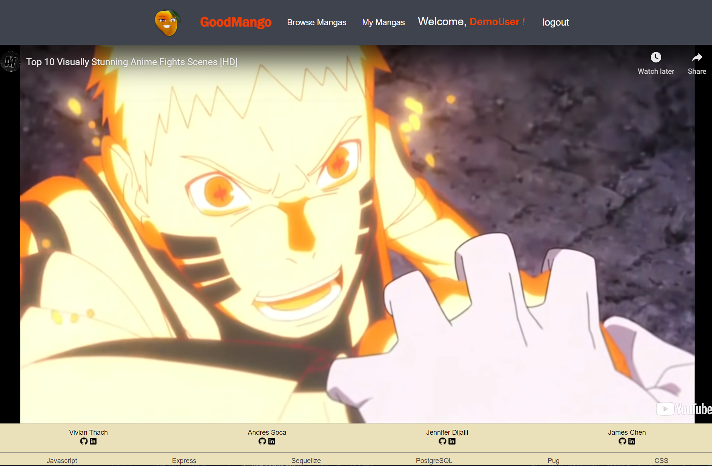
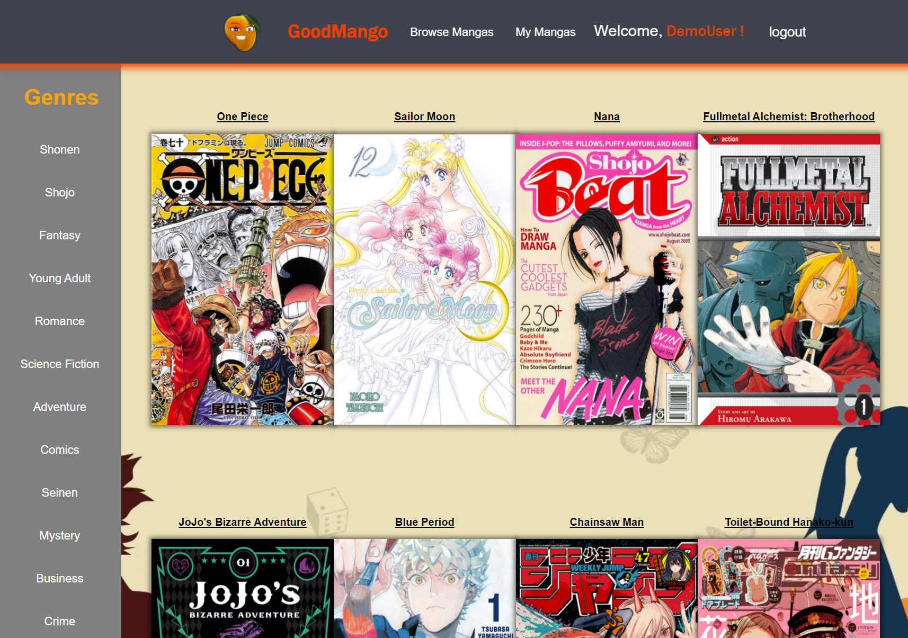
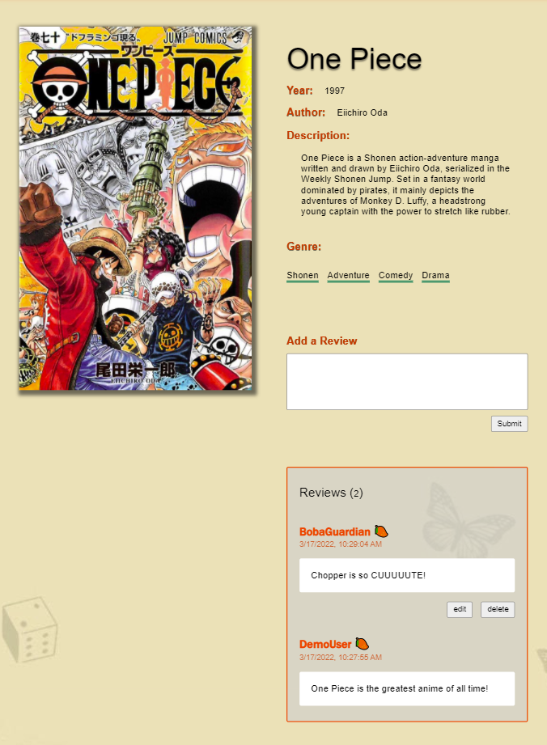
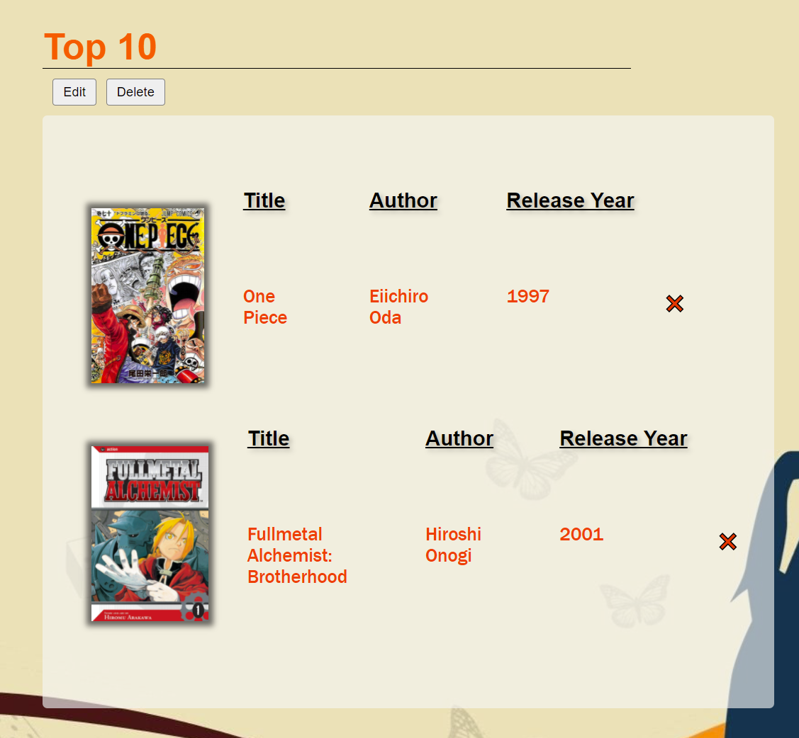
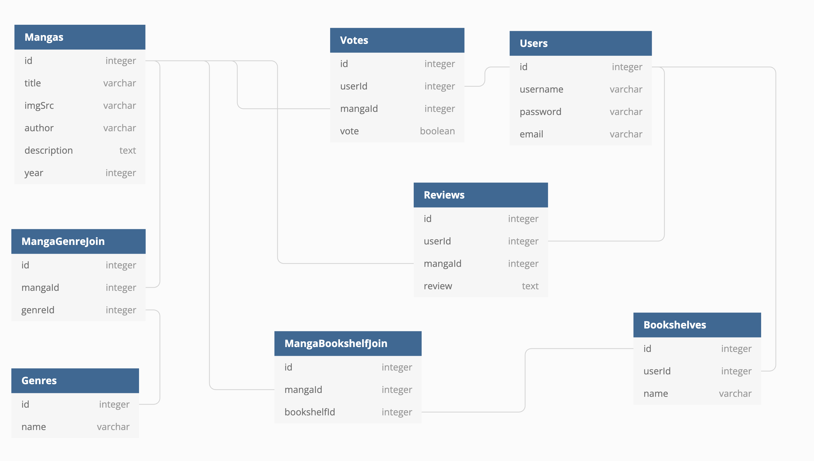

## GoodMango

GoodMango is an online social platform, for members interested in Manga, inspired by [Goodreads](https://www.goodreads.com/). On the website, you can read, review, and research different types of manga.

Here, you can find your favorite manga: [GoodMango](https://goodmango.herokuapp.com/)

### Splash Page

The splash page displays a large banner video of the top anime battle scenes.  Users can log into an existing account or sign up to create a new account.  There is an option to demo the site through the login and signup pages.



### Browse Manga

Users can browse the different manga Good Mango has in its database here.  Clicking on a manga cover will redirect the user to the manga's details page.



### Manga Details

This page displays a specific manga's details including its title, year, author, and description.  There is also a genre list where upon click will redirect the user to a list of manga of that genre.  Below holds the reviews for that specific manga.



### Manga Bookshelves

Users can create bookshelves via the "My Manga" link on the navigation bar.  Here, users can keep track of book lists and add manga to them via their manga detail page.



### Database Schema



## Features

- Create an account
- Log in/out and demo user
- Read important details of manga
- Search manga with different genres
- Logged in users can add bookshelves to view a collection of manga
- Logged in users can add reviews to manga


## Installation

  1. Clone the repository ```git clone https://github.com/jdijaili/w13-goodMango-group-project.git```
  2. Install necessary dependencies for node.js ```npm install```
  3. Create a database called `good_mango`
  4. Set password as 'password' or any password. *Note: make sure it is the same password as the one in the .env file variables*
  5. Create a new env file. Use `.env.example` as a reference.
  6. Run migrations and seed data: ` npx dotenv sequelize db:migrate ` && `npx dotenv sequelize db:seed:all `
  7. Start the server: `npm start`

## Techologies Used

- JavaScript
- Express
- Git
- Pug
- CSS
- BCrypt
- Heroku
- Sequelize
- PostgreSQL

## Documentation Links
- [Documentation Home Page](https://github.com/jdijaili/w13-goodMango-group-project)
- [API Documentation](https://github.com/jdijaili/w13-goodMango-group-project/wiki/API-Documentation)
- [Database Schema](https://github.com/jdijaili/w13-goodMango-group-project/wiki/Database-Schema)
- [Frontend Routes](https://github.com/kvh8899/week13-project/wiki/Frontend-Routes)
- [MVP Feature List](https://github.com/jdijaili/w13-goodMango-group-project/wiki/Frontend-Routes)
- [User Stories](https://github.com/jdijaili/w13-goodMango-group-project/wiki/User-Stories)

## Contributors

- [Jennifer Dijaili](https://github.com/jdijaili)
- [Vivian Thach](https://github.com/bobaguardian)
- [James Chen](https://github.com/jameschen56)
- [Andres Soca](https://github.com/DevDre783)
